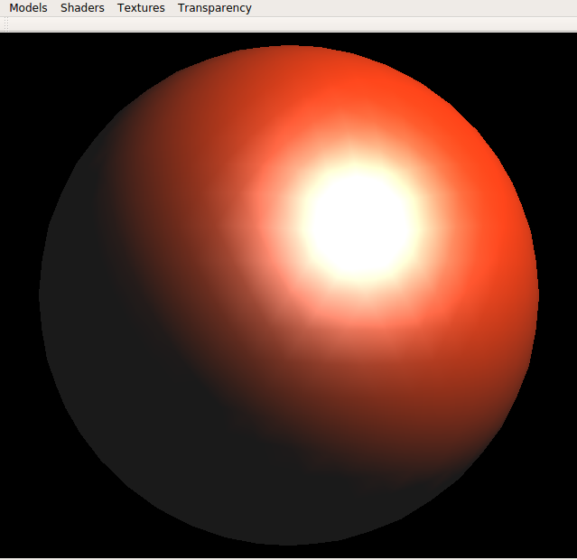
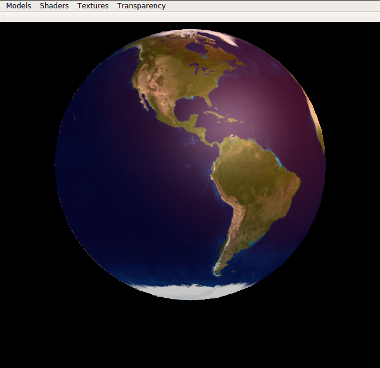
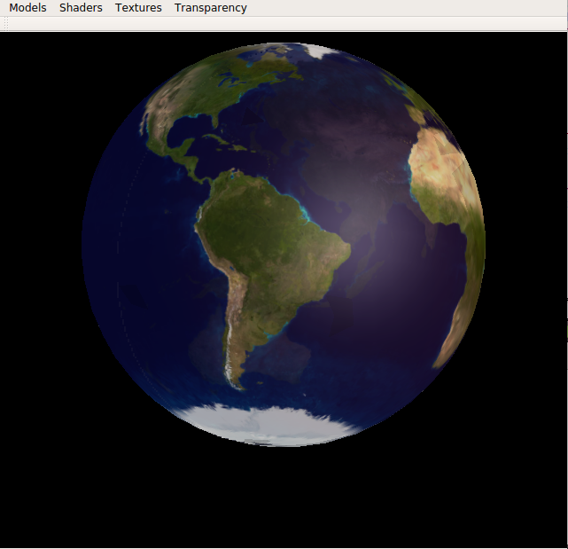
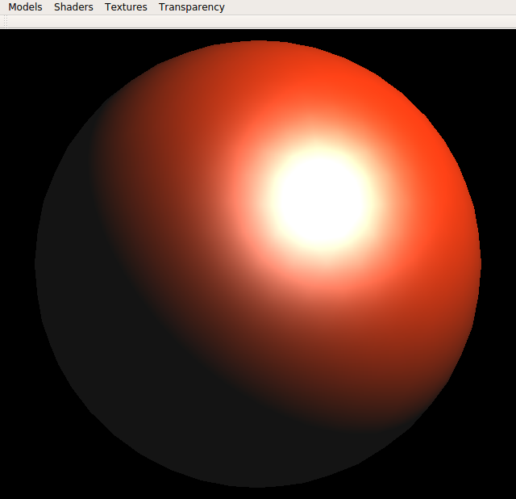
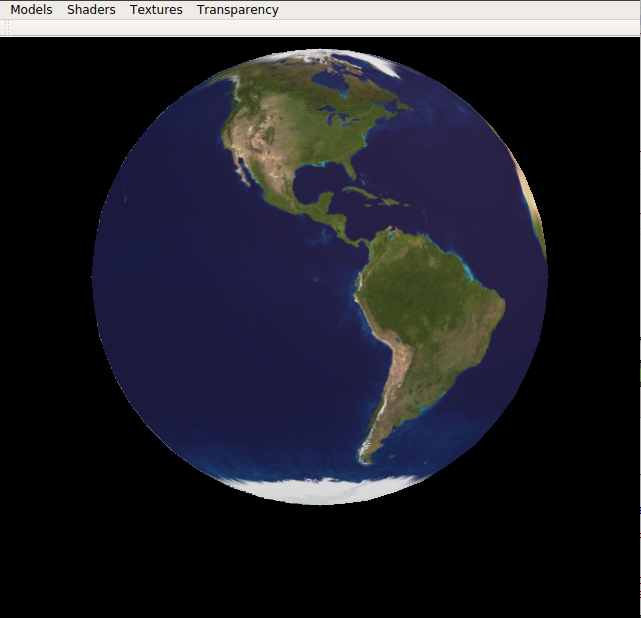
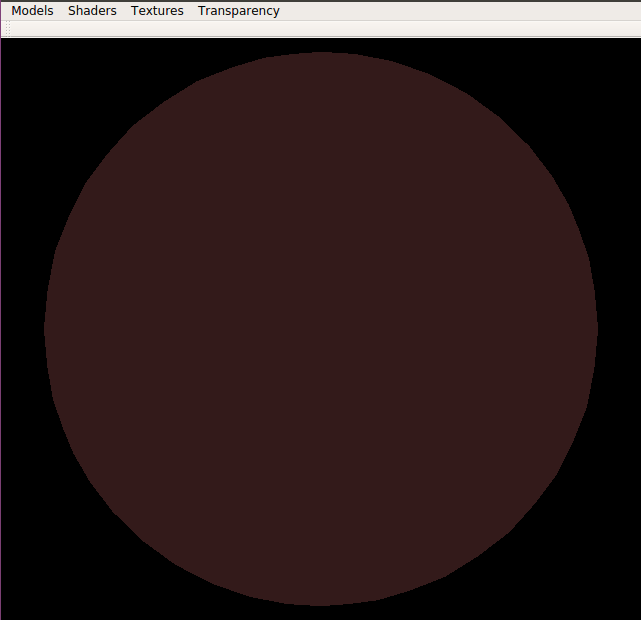

# Practica2GPU2016

Nota para ejecución del programa:
^^^^^^^^^^^^^^^^^^^^^^^^^^^^^^^^

1. Seleccionar el objeto [por defecto se activa Gouraud]
2. Seleccionar Luz actual.

    2.1 Por defecto añado  Luz puntual. donde se puede jugar con la intensidad del color y la posicion de la luz y el tema de apagado o encendido.
    
    2.2 Apagar la luz puntual y seleccionar Luz direccional, lo añadimos, y se podrá jugar con la intensidad, etc. 
    
3. Selecionar otro tipo de Shading.
4. Seleccionar textura como Gouraud o Phong Shading.

    4.1 Se puede seleccionar Luz actual y jugar.
    
    4.2 Si seleccionamos, Gouraud Textura, podemos utilizar la opcion de Transparency, donde podemos cambiar el componente Alpha del material. Tambien lo podemos utilizar para el shading Gouraud o Phong.

Fases implementadas:
^^^^^^^^^^^^^^^^^^^

Fase 1
-------
- Paso 1
- Paso 2 (Sin Spotlight)
- Paso 3
- Paso 4 (Sin siluetas)

Fase 2
-------
- Paso 1
- Paso 2

Problemas:
^^^^^^^^^

* Toon Shading: no se visualiza del todo bien. Las tonalidades no se aprecia. 
Se ha añadido el código de teoria pero no funciona.
* Cuando se esta cambiando los tipos de Shandings, al seleccionar toon se debe de seleccionar otra vez el objeto.

Extras:
^^^^^^^

- En la aplicación, he añadido otra opción para poder cambiar el componente Alpha del material, para si poder ver las trasparencia. Sólo implementado para Gouraud, Phong y Gouraud Textura.

Resultado
^^^^^^^^^^
Gouroud, Texture & tranparency

Phong

Toon

