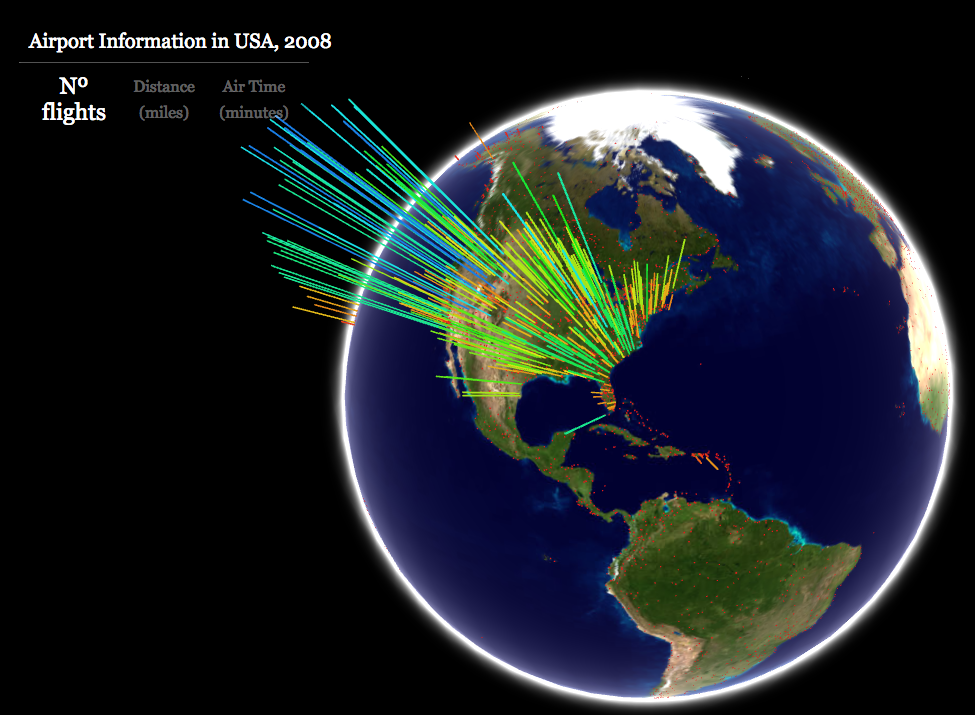
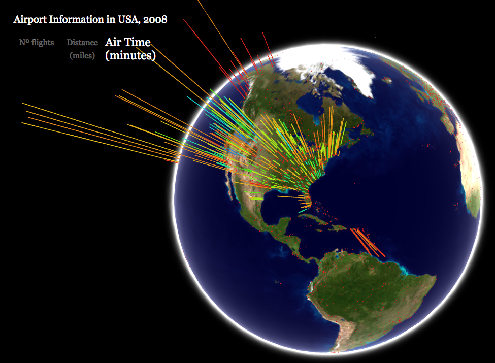

GiV - P3
----------  
::

Abstract
^^^^^^^^
Visualización de los aeropuertos de los Estados Unidos en el año 2008.
Se muestrán el número total de vuelos, la distancia recorrida en cada vuelo y el tiempo de vuelo.
Todos los datos han sido normalizados.

Se ha modificado el HTML para que corresponda con los datos a mostrar.
El script para obtener el JSON, es el fichero read.py

Las fuentes de los datos:

https://openflights.org/data.html
http://stat-computing.org/dataexpo/2009/the-data.html

--
Alvaro Escurra

Screenshots
^^^^^^^^^^^
Nº de vuelos

Distancia (millas)

.. image:: distance.png

Tiempo de vuelo

Additional Information
^^^^^^^^^^^^^^^^^^^^^^

