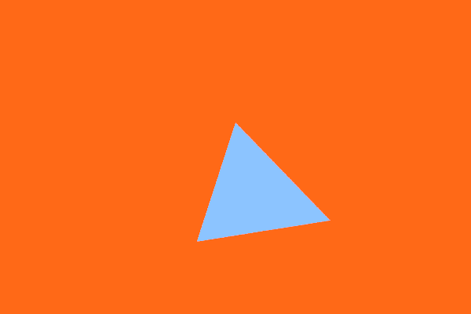

GiV - P1 [Universitat de Barcelona 2016/17]
----------  
::

Abstract
^^^^^^^^
En esta práctica hemos aplicado la construcción de diferentes objetos, como los
planos, esferas, triángulos, cubo y Boundary (no funciona del todo bien). Para ellos en cada uno de ellos es importante
codificar el método hit() que sirve para saber si hemos inter-seccionado con el
objeto en cuestión o no.

Ver como funciona el algoritmo de RayTracing. Lo que
hace este algoritmo es que para cada pixel de la imagen lanzaremos rayos
(primarios) en los que se comprobará si intersecta con algún objeto de la escena.

Se comprueba como el objeto se comporta con la luz de la escena y la posición
del observador, se calculará el color que le corresponde dependiendo de la luz
que le llega, teniendo en cuenta el tipo de material que es, en este caso mate o
metálico.

Hemos aplicado recursión al método computeColor() para poder ver como en
materiales Metálicos actúan como espejos frente la escena. Para poder realizar
esto hemos tenido que lanzar rayos secundarios contra la escena.

Hemos llegado hasta reflexiones de materiales metálicos.
Nos ha faltado el material Transparente.

Features
^^^^^^^^

- Figures
    - Plane
    - Triangle
    - Sphere
    - Cube
- Blinn-Phong
    - Light
    - Basic Blinn-Phong
    - Recursive Blinn-Phong
- Material
    - Metal

Screenshots
^^^^^^^^^^^
Escena: Principal

.. image:: escena_practica.png

Escena: 2 planos y esfera

.. image:: escena_dosPlanos_esfera.png

Escena: habitación con dos esferas y un cubo

.. image:: scene_room_2spheres_cube.png

Escena: Random esferas, con diferentes materiales y 2 luces

.. image:: escena_3_esferas.png

Escena: Triangulo

