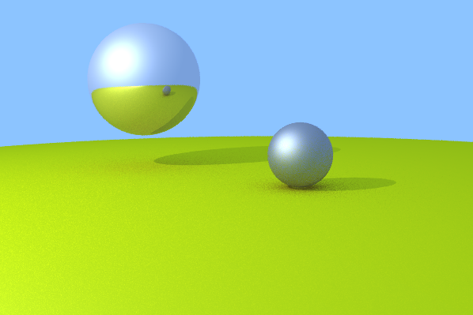
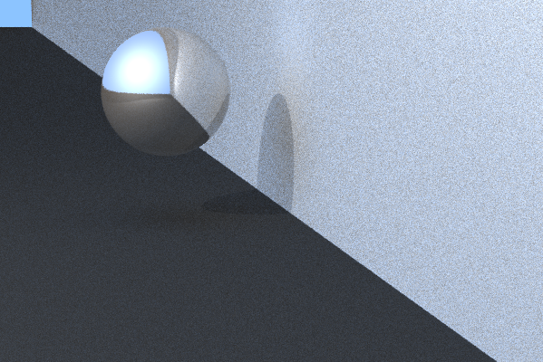
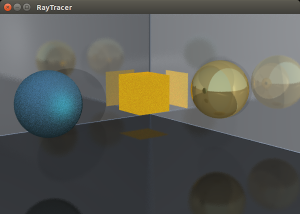
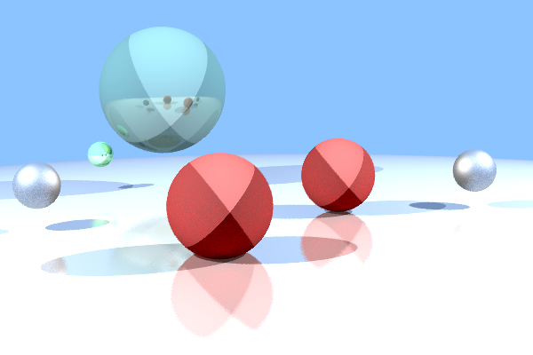

GiV - P1
----------  
::

Abstract
^^^^^^^^
En esta práctica hemos aplicado la construcción de diferentes objetos, como los
planos, esferas, triángulos y cubo. Para ellos en cada uno de ellos es importante
codificar el método hit() que sirve para saber si hemos inter-seccionado con el
objeto en cuestión o no.

Y lo mas importante es ver como funciona el algoritmo de RayTracing. Lo que
hace este algoritmo es que para cada pixel de la imagen lanzaremos rayos
(primarios) en los que se comprobará si intersecta con algún objeto de la escena.

Se comprobara como el objeto se comporta con la luz de la escena y la posición
del observador, se calculará el color que le corresponde dependiendo de la luz
que le llega, teniendo en cuenta el tipo de material que es, en este caso mate o
metálico.

Hemos aplicado recursión al método computeColor() para poder ver como en
materiales Metálicos actúan como espejos frente la escena. Para poder realizar
esto hemos tenido que lanzar rayos secundarios contra la escena.

Features
^^^^^^^^

- Figures
    - [Alvaro] Plane
    - [Alvaro - Enrique] Triangle
    - [Profesores] Sphere
    - [Alvaro - Enrique] Cube
    - [-] Boundary Object
- Blinn-Phong
    - [Alvaro] Light
    - [Alvaro] Basic Blinn-Phong
    - [Alvaro] Recursive Blinn-Phong
- Material
    - [Alvaro - Enrique] Metal
    - [-] Transparent
    - [-] Isotropic
    - [-] Volume

Extensions
^^^^^^^^^^
-

Screenshots
^^^^^^^^^^^
Escena: Principal

Escena: 2 planos y esfera

Escena: habitación con dos esferas y un cubo

Escena: Random esferas, con diferentes materiales y 2 luces

Additional Information
^^^^^^^^^^^^^^^^^^^^^^
Las horas de dedicación más de las que se aconseja en cada fase.
Los problemas principales que hemos tenido, es a la hora de crear los objetos ya que requieren un nivel básico de algebra.
Entender las formulas descritas en la teoria.
Intentar crear las posiciones de los objetos en la escena.

